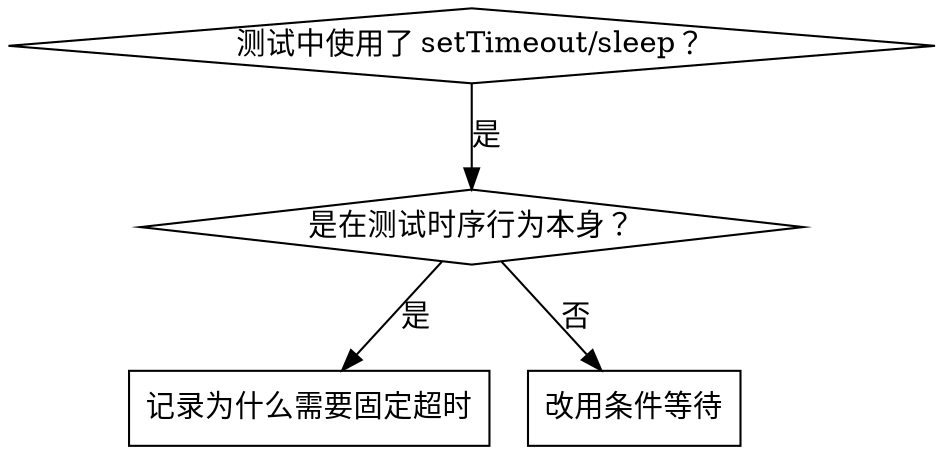

# Condition-Based Waiting - 条件等待

## 概述

不稳定测试（flaky test）往往依赖任意时间的延迟来猜测时序，在高负载或 CI 环境下容易产生竞态条件。

**核心原则：** 等待你真正关心的条件满足，而不是猜一个大概的时间。

## 适用场景



**适用于：**
- 测试中存在任意延迟（`setTimeout`、`sleep`、`time.sleep()`）
- 测试结果不稳定（本地偶尔通过，高负载下失败）
- 并行运行时测试超时
- 等待异步操作完成

**不适用：**
- 测试 debounce、throttle 等时序行为本身
- 若确实需要固定超时，必须在注释中说明原因

## 核心模式

```typescript
// ❌ 之前：猜测时间
await new Promise(r => setTimeout(r, 50));
const result = getResult();
expect(result).toBeDefined();

// ✅ 之后：等待条件
await waitFor(() => getResult() !== undefined);
const result = getResult();
expect(result).toBeDefined();
```

## 常用模式速查

| 场景 | 写法 |
|------|------|
| 等待事件 | `waitFor(() => events.find(e => e.type === 'DONE'))` |
| 等待状态 | `waitFor(() => machine.state === 'ready')` |
| 等待数量 | `waitFor(() => items.length >= 5)` |
| 等待文件 | `waitFor(() => fs.existsSync(path))` |
| 复合条件 | `waitFor(() => obj.ready && obj.value > 10)` |

## 实现

通用轮询函数：
```typescript
async function waitFor<T>(
  condition: () => T | undefined | null | false,
  description: string,
  timeoutMs = 5000
): Promise<T> {
  const startTime = Date.now();

  while (true) {
    const result = condition();
    if (result) return result;

    if (Date.now() - startTime > timeoutMs) {
      throw new Error(`Timeout waiting for ${description} after ${timeoutMs}ms`);
    }

    await new Promise(r => setTimeout(r, 10)); // 每 10ms 轮询一次
  }
}
```

完整实现及领域专用辅助函数（`waitForEvent`、`waitForEventCount`、`waitForEventMatch`）见本目录下的 `condition-based-waiting-example.ts`。

## 常见错误

**❌ 轮询过快：** `setTimeout(check, 1)` — 浪费 CPU
**✅ 修正：** 每 10ms 轮询一次

**❌ 无超时保护：** 条件永远不满足时死循环
**✅ 修正：** 始终设置超时，并给出清晰的错误信息

**❌ 读取过期数据：** 在循环外缓存了状态
**✅ 修正：** 在循环内调用 getter，每次读取最新数据

## 固定超时的合理场景

```typescript
// 工具每 100ms tick 一次，需要等 2 个 tick 来验证部分输出
await waitForEvent(manager, 'TOOL_STARTED'); // 先等条件满足
await new Promise(r => setTimeout(r, 200));   // 再等时序行为
// 200ms = 2 个 tick（间隔 100ms）— 有依据，非猜测
```

**使用固定超时的前提：**
1. 先等触发条件满足
2. 时间基于已知的间隔，而非猜测
3. 注释中说明原因

## 实际效果

来自调试会话（2025-10-03）：
- 修复了 3 个文件中的 15 个不稳定测试
- 通过率：60% → 100%
- 执行时间加快 40%
- 彻底消除竞态条件
