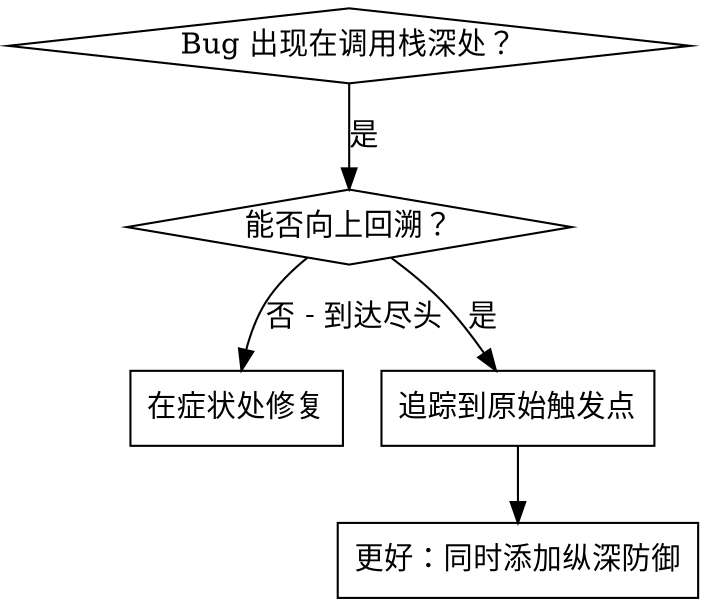
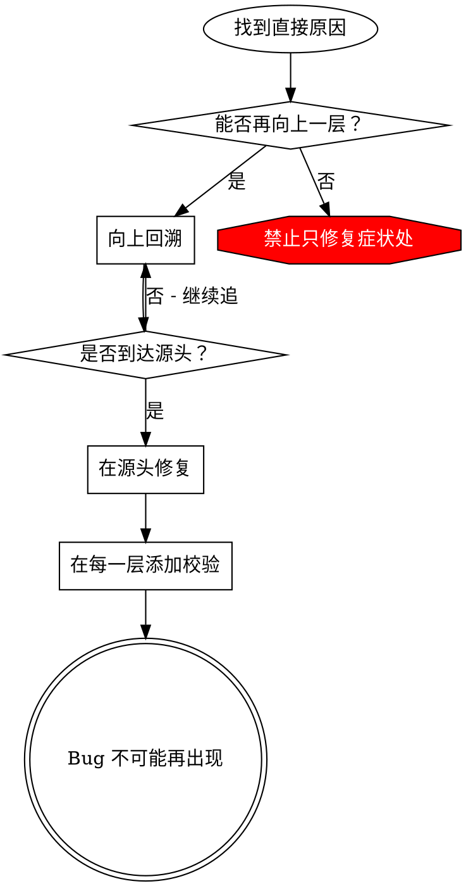

# Root Cause Tracing - 根因追踪

## 概述

Bug 往往暴露在调用栈深处（如 git init 在错误目录执行、文件写入错误位置、数据库以错误路径打开）。直觉上会在报错处修复，但那只是在处理症状。

**核心原则：** 沿调用链向上回溯，找到最初的触发点，在源头修复。

## 适用场景



**适用于：**
- 错误发生在执行深处（非入口点）
- 调用栈较长
- 不清楚无效数据从哪里产生
- 需要找出是哪段测试/代码触发了问题

## 追踪过程

### 1. 观察症状
```
Error: git init failed in ~/project/packages/core
```

### 2. 找到直接原因
**哪段代码直接触发了这个错误？**
```typescript
await execFileAsync('git', ['init'], { cwd: projectDir });
```

### 3. 向上追：谁调用了这里？
```typescript
WorktreeManager.createSessionWorktree(projectDir, sessionId)
  → 被 Session.initializeWorkspace() 调用
  → 被 Session.create() 调用
  → 被测试中的 Project.create() 调用
```

### 4. 继续向上追
**传入的值是什么？**
- `projectDir = ''`（空字符串！）
- `cwd` 为空字符串时，会 resolve 为 `process.cwd()`
- 即源码目录本身

### 5. 找到原始触发点
**空字符串从哪里来？**
```typescript
const context = setupCoreTest(); // 返回 { tempDir: '' }
Project.create('name', context.tempDir); // 在 beforeEach 执行前就访问了！
```

## 添加堆栈追踪

无法手动回溯时，添加诊断插桩：

```typescript
// 在出问题的操作之前
async function gitInit(directory: string) {
  const stack = new Error().stack;
  console.error('DEBUG git init:', {
    directory,
    cwd: process.cwd(),
    nodeEnv: process.env.NODE_ENV,
    stack,
  });

  await execFileAsync('git', ['init'], { cwd: directory });
}
```

**注意：** 测试中使用 `console.error()`，而非 logger（logger 的输出可能被抑制）

**运行并捕获：**
```bash
npm test 2>&1 | grep 'DEBUG git init'
```

**分析堆栈追踪：**
- 寻找测试文件名
- 找到触发调用的行号
- 识别规律（同一个测试？同一个参数？）

## 定位污染测试

如果测试中出现了预期外的副作用，但不确定是哪个测试造成的：

使用本目录下的二分查找脚本 `find-polluter.sh`：

```bash
./find-polluter.sh '.git' 'src/**/*.test.ts'
```

逐个运行测试，遇到第一个污染者即停止。详见脚本说明。

## 真实案例：空 projectDir

**症状：** `.git` 被创建在 `packages/core/`（源码目录）

**追踪链：**
1. `git init` 在 `process.cwd()` 执行 ← cwd 参数为空
2. WorktreeManager 以空 projectDir 被调用
3. Session.create() 传入了空字符串
4. 测试在 beforeEach 执行前就访问了 `context.tempDir`
5. setupCoreTest() 初始返回 `{ tempDir: '' }`

**根本原因：** 顶层变量初始化时访问了尚未赋值的空值

**修复方案：** 将 tempDir 改为 getter，在 beforeEach 执行前访问时抛出异常

**同时添加了纵深防御：**
- 第一层：Project.create() 校验目录
- 第二层：WorkspaceManager 校验非空
- 第三层：NODE_ENV 守卫，测试环境下拒绝在 tmpdir 外执行 git init
- 第四层：git init 前记录堆栈追踪

## 核心原则



**禁止只修复报错处。** 回溯到原始触发点，在源头修复。

## 堆栈追踪技巧

**测试中：** 使用 `console.error()`，而非 logger（logger 可能被抑制）
**操作前记录：** 在危险操作之前打日志，而非等报错后
**包含上下文：** 目录、cwd、环境变量、时间戳
**捕获调用链：** `new Error().stack` 展示完整调用链

## 实际效果

来自调试会话（2025-10-03）：
- 经 5 层追踪找到根本原因
- 在源头修复（getter 校验）
- 添加 4 层防御
- 1847 个测试全部通过，零污染
